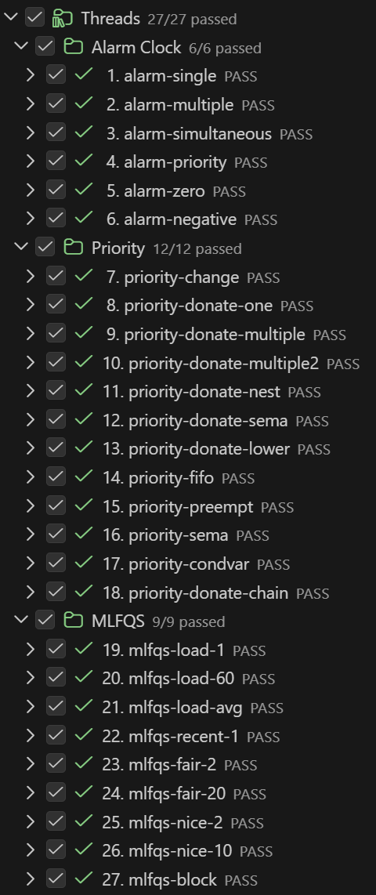
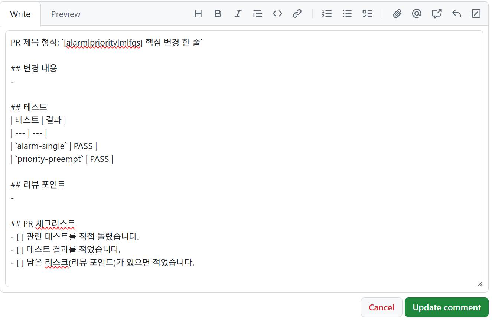

# 6조 Pintos 프로젝트 회고

## 팀 구성

- 교육장: 302
- 팀 번호: 6조
- 팀원: 구름, 송채강, 여서진, 위승철

## 도입

### 협업 방식 개요

- `alarm` 단계에서는 4명이 모두 각자 구현함
- 프로젝트 초반이기도 했고, 기본기 확보와 코드베이스 적응이 우선이라고 판단했기 때문임
- `priority` 단계부터는 2:2로 나누어 테스트를 분담해 구현함
- 같은 테스트를 두 명이 각각 풀어 보면서 서로 다른 구현 방식을 비교하는 방식으로 진행함
- 코어타임에는 PR 리뷰 시간을 운영함
- 각자 구현 내용을 설명하고, 더 좋은 방향의 코드를 취합해 `dev` 브랜치에 merge함
- `dev` 브랜치에서 테스트 통과를 확인한 뒤 `main` 브랜치에 최종 merge함

### 성공한 테스트 및 개인별 진도



#### 구름
- `alarm`부터 `priority-donate`까지 구현 완료
- `alarm`, `priority` 전 테스트 통과 완료

#### 송채강

- `alarm`부터 `MLFQS`까지 전 구간 구현 완료함
- 전체 테스트 통과 완료함

#### 여서진
- `alarm` 전 테스트 pass
- `priority` 전 테스트 pass
- `priority-donation` 전 테스트 pass
- `mlfqs` 미구현


#### 위승철


## Alarm - 송채강

### 구현 과정

- 초반에 가장 크게 막힌 부분은 스레드 상태에 대한 이해 부족이었음
- 처음에는 `sleep_list`에서 빠져나오면 바로 `running` 상태라고 생각했음
- 이 오해 때문에 상태 전이 흐름을 잘못 이해한 채 구현을 시작했고, 디버깅 시간이 길어졌음

### 트러블슈팅

#### 1. 스레드를 재우는 순서 문제

- 초기 구현에서는 스레드를 `sleep_list`에 넣은 뒤 `block`을 거는 방식으로 처리함
- 하지만 이 방식은 두 동작 사이에 인터럽트 핸들러가 끼어들 수 있다는 문제가 있었음
- 그 결과 `block` 되기 전에 스레드가 먼저 깨어날 수 있는 가능성이 생겼음
- 처음에는 이 문제를 인지하지 못했지만, AI에게 코드 리뷰를 요청하는 과정에서 해당 가능성을 발견함
- 이후 코드 흐름을 다시 따라가며 위험 구간을 확인했고, `sleep_list` 삽입과 `block` 처리 사이가 끊기지 않도록 수정 방향을 잡음

```c
static void
timer_interrupt (struct intr_frame *args UNUSED) {
	ticks++;

	if (!list_empty (&sleep_list)) {
		struct thread *t = list_entry (list_front (&sleep_list),
		                               struct thread, elem);

		if (t->wake_up_tick <= ticks) {
			struct thread *tmp = list_entry (list_pop_front (&sleep_list),
			                                 struct thread, elem);
			thread_unblock (tmp);
		}
	}

	thread_tick ();
}
```

#### 2. 동시에 깨어나는 스레드 처리 문제

- 처음에는 `sleep_list`의 맨 앞 스레드 하나만 확인하는 방식으로 구현함
- 이 방식은 여러 스레드가 같은 tick에 동시에 깨어나야 하는 상황을 제대로 처리하지 못했음
- 테스트를 다시 확인하고, 개념 정리 내용을 재검토하는 과정에서 이 누락을 발견함
- 해결을 위해 조건을 만족하는 스레드를 모두 꺼내는 방식으로 수정함
- 최종적으로 `while`문을 사용해 동시에 깨어나야 하는 스레드를 전부 처리하도록 변경함

```c
static void
timer_interrupt (struct intr_frame *args UNUSED) {
	ticks++;

	while (!list_empty (&sleep_list)) {
		struct thread *t = list_entry (list_front (&sleep_list),
		                               struct thread, elem);

		if (t->wake_up_tick > ticks)
			break;

		struct thread *tmp = list_entry (list_pop_front (&sleep_list),
		                                 struct thread, elem);
		thread_unblock (tmp);
	}

	thread_tick ();
}
```

### 개인적인 회고

- 처음에 겁먹었던 것보다는 덜 힘들었지만, 그렇다고 쉬운 과제는 아니었다고 느낌
- 체감상 C 주차와 비슷한 결의 어려움이 있었음
- 구현 속도를 우선하다 보니 서로 설명하고 설명을 듣는 시간이 부족했던 점도 문제로 느낌
- 다음 주에는 구현 자체뿐 아니라 설명과 개념 공유 시간을 더 의식적으로 확보할 필요가 있다고 판단함
- 막히는 지점에서는 AI의 코드 리뷰와 피드백을 활용함
- 다음주에는 AI 활용을 더 줄이고 싶음

## Priority - 구름

### 구현 과정

#### 1. 문제 : 추상화의 어려움

- 이번 구현에서 가장 어려웠던 점은 helper, handler, wrapper, 구조체를 활용해 역할을 나누고 추상화하는 일이었음. 게다가 세마포어, 락, 컨디션 변수처럼 서로 연결되어 있으면서도 역할이 다른 개념들을 한꺼번에 이해하는 것이 쉽지 않았음. 여러 구조체가 계층적으로 연결된 구조를 이해하는 것도 쉽지 않았고, 인터럽트 문맥인지 아닌지까지 고려하면서 스레드의 실행 흐름과 상태 변화를 따라가는 과정도 어려웠음. 특히 어려웠던 부분 중 하나는 condition variable과 waiter 흐름을 코드 구조와 연결해서 이해하는 일이었음.
- 특히 “스레드가 lock을 잡는다”, “blocked 상태가 된다”, “ready 상태가 된다”, “priority가 올라간다”, “실행 중이다”는 한 부분을 바꿨다고 해서 다음 상태가 자동으로 이어지거나 관련 함수가 저절로 호출되는 것은 아니라는 점을 이번에 분명히 알게 되었음.
- 그리고 먼저 개념 구조를 이해해야 코드가 읽힌다는 점을 체감했음.

#### 2. 해결 : 추상화의 어려움
- AI에게 구조를 그려 달라고 하거나, 아이패드에 함수와 구조체 관계를 직접 정리하면서 겨우 흐름을 잡을 수 있었음.
- 아직 다른 사람과 개념을 주고받으며 검증해 보지 않았기 때문에, 내가 잘못 이해한 부분이 남아 있을 수도 있다고 생각함. 그래서 오늘은 개념과 흐름이 맞는지, 놓친 부분은 없는지 다른 사람과 점검하는 시간을 가져보려고 함.

### 트러블슈팅

- 처음부터 큰 범위를 한 번에 해결하려고 하기보다, 간단한 테스트부터 하나씩 해결하면서 구현 범위를 넓혀 갔음.
- 문제 하나하나의 정답을 얻는 것보다, 익숙하지 않은 프로젝트나 문제를 마주쳤을 때 해결하는 방법 자체를 배우는 데 더 집중했음.
- AI의 도움을 받아 함께 학습하고 예외 상황을 점검했으며, 기능 하나를 넘어갈 때마다 AI의 도움을 받는 비중도 점차 줄일 수 있었음.
- 하나의 문제를 해결하려면 여러 지점을 함께 고려하고 고쳐야 하는 상황이 처음이라 쉽지 않았지만, 그런 과정을 반복하면서 점차 흐름을 익혀 갔음.
- AI를 구조를 시각화하고 test 외 예외 상황도 점검하는 도구로도 활용했음.

### 특별히 알리고 싶은 부분

- 좋은 협업 방식은 하나로 고정된 정답이 아니라 구체적인 상황에 따라 달라진다고 느낌.
- 구현 속도, 개념 이해도, 팀원 각자가 이 프로젝트를 통해 얻고 싶은 것, 팀원 간 편차에 따라 협업 방식을 조정할 필요가 있음을 확인함.
- AI에게 구체적으로 상황을 말하니 그에 맞춰 방식을 이야기 해줌.

.png>)

### 개인적인 회고

- 개인적으로는 운영체제가 어떻게 만들어지는지 더 궁금해졌음. 이렇게 간단한 시스템 하나를 구현하는 것도 복잡한데, 실제 시스템은 어떻게 이렇게 많은 경우를 고려하는지 신기했음. 그래서 QA와 테스트가 왜 중요한지도 더 실감할 수 있었음.
- 이렇게 남이 작성한 코드를 많이 읽어 본 것도 거의 처음이었는데, 세부 코드는 빠르게 훑더라도 함수들이 서로 어떻게 연결되어 있는지는 정확히 이해한 상태여야 다음 작업을 이어갈 수 있다는 점을 느꼈음.
- 걱정했던 것과 달리, 그동안 조금씩 쌓아 온 기반 지식 덕분에 이전 주차들보다 덜 막히는 부분도 있었음
- 동시에 AI 학습법에 대한 고민이 어느정도 정리된 주간이였음. 단계별로 AI 사용 정도를 조정하는 학습 스타일을 시도해봤는데 시간관리와 개념 학습, 문제 해결력 성장 도모 모두 성공적이였던거 같아 의미 있는 주간이었음. 하지만 특강을 들으면서도 내부 원리를 충분히 이해하지 못했다는 한계도 체감하고, 퀴즈를 볼 때마다 놓친 부분이 드러나서 AI 사용 방식 자체에 대한 고민도 계속 생김.

## Donation - 여서진

### 구현 과정

- 가장 까다로웠던 부분은 중첩 락 구조 처리였음
- `H -> M -> L`처럼 락 대기가 꼬리를 무는 상황에서는 단발성 donation만으로는 문제가 해결되지 않았음
- 결국 맨 아래에 있는 `L`까지 우선순위 영향이 전달되어야 전체 체인이 해소되는 구조였음

### 해결 과정

- `give_donation()` 내부에서 `while`문을 활용해 연쇄적으로 추적하는 방식을 선택함
- 현재 락의 holder가 또 다른 락을 기다리고 있는지 계속 확인하며 다음 대상으로 이동함
- `current_lock = hold->wait_on_lock;` 구조를 사용해 체인을 따라 내려가는 방식으로 구현함
- 최대 8단계까지 priority를 전파하도록 구성해 nested donation 상황에 대응함
- 그 결과 대기 체인 전체에 우선순위가 반영되도록 구조를 정리할 수 있었음

### 트러블슈팅

#### 1. `lock_acquire()`에서의 조건 검사 및 상태 저장

- 처음에는 "현재 락이 사용 중인가" 정도만 확인하면 된다고 생각했음
- 실제 핵심은 내가 잡으려는 락에 `holder`가 있는지 확인하는 과정이었음
- holder가 존재하는 경우에는 현재 스레드가 block 되기 전에 필요한 상태를 먼저 저장해야 했음

1. 현재 스레드의 `wait_on_lock` 저장함
2. holder의 `donations` 리스트에 현재 스레드를 등록함
3. `give_donation()`을 호출해 즉시 priority를 전달함

```c
void
lock_acquire (struct lock *lock) {
	ASSERT (lock != NULL);
	ASSERT (!intr_context ());
	ASSERT (!lock_held_by_current_thread (lock));

	if (lock->holder != NULL) {
		thread_current ()->wait_on_lock = lock;
		list_insert_ordered (&lock->holder->donations,
		                     &thread_current ()->donation_elem,
		                     cmp_donation_priority, NULL);
		give_donation (lock);
	}

	sema_down (&lock->semaphore);
	thread_current ()->wait_on_lock = NULL;
	lock->holder = thread_current ();
}
```

#### 2. `give_donation()` 로직을 통한 chain 해결

- 락 하나만 보고 끝나는 donation 구조로는 nested case를 처리할 수 없었음
- donation을 받은 스레드가 또 다른 락을 기다리는 상황까지 따라가야 실제 병목이 해소되었음
- `H -> M -> L` 구조에서는 가장 아래까지 영향이 전달되어야 전체 흐름이 복구되는 형태였음
- 이를 위해 다음 락을 계속 추적하면서 priority를 전파하는 방식으로 구현함

```c
void
give_donation (struct lock *lock) {
	int depth = 0;
	int priority = thread_current ()->priority;
	struct lock *current_lock = lock;

	while (current_lock != NULL &&
	       current_lock->holder != NULL &&
	       depth < 8) {
		struct thread *hold = current_lock->holder;

		if (hold->priority < priority)
			hold->priority = priority;

		current_lock = hold->wait_on_lock;
		depth++;
	}
}
```

#### 3. `lock_release()`에서의 우선순위 복구

- 락을 반환할 때 donor를 단순히 제거하는 것만으로는 priority 복구가 충분하지 않았음
- multiple donation 상황에서는 가장 높은 donation을 준 스레드가 방금 제거되는 대상일 수도 있었음
- 따라서 남아 있는 donor 전체를 다시 순회하며 최종 priority를 재계산해야 했음

1. 현재 해제하는 락을 기다리던 donor를 제거함
2. 남아 있는 `donations` 리스트 전체를 다시 순회함
3. donor가 없으면 `init_priority`로 복구함
4. donor가 남아 있으면 최댓값 기준으로 priority를 다시 설정함

```c
void
lock_release (struct lock *lock) {
	ASSERT (lock != NULL);
	ASSERT (lock_held_by_current_thread (lock));

	struct thread *cur = thread_current ();
	struct list_elem *e = list_begin (&cur->donations);

	while (e != list_end (&cur->donations)) {
		struct thread *donor = list_entry (e, struct thread, donation_elem);
		struct list_elem *next = list_next (e);

		if (donor->wait_on_lock == lock)
			list_remove (e);

		e = next;
	}

	cur->priority = cur->init_priority;
	e = list_begin (&cur->donations);

	while (e != list_end (&cur->donations)) {
		struct thread *donor = list_entry (e, struct thread, donation_elem);

		if (donor->priority > cur->priority)
			cur->priority = donor->priority;

		e = list_next (e);
	}

	lock->holder = NULL;
	sema_up (&lock->semaphore);
}
```

### 개인적인 회고

- 요구사항을 먼저 정확히 읽는 습관의 중요성을 느낌
- AI를 단순 정답 제공 도구가 아니라 사고 정리 보조 도구로 활용할 수 있다는 점을 다시 확인함
- 기본 도구와 구조를 먼저 파악한 뒤 구현해야 디버깅이 훨씬 수월해진다는 점을 배움
- 선 구현 후 피드백 방식이 생각보다 효과적이었다는 경험을 함

## MLFQS - 위승철

### 구현 과정

- `mlfqs` 구현을 중심으로 작업함
- 스케줄링 계산 로직과 테스트 대응 과정에 대한 추가 정리가 필요함
- 현재 문서 기준으로는 세부 구현 설명이 비어 있는 상태임

### 트러블슈팅

- 실제 테스트 오류와 해결 과정에 대한 추가 작성이 필요함
- 구현 과정에서 어려웠던 개념과 디버깅 포인트도 보완 정리할 필요가 있음

### 특별히 알리고 싶은 부분

- 팀 회고 문서에 반영할 수 있도록 추가 내용 정리가 필요함

### 개인적인 회고

- 세부 회고 내용 추가 작성이 필요함

## 마무리(팀 차원 회고)

### 잘된 점

- 같은 테스트를 두 명이 병행 구현하면서 서로 다른 코드를 비교할 수 있었음
- 두 가지 코드 중 더 좋은 방향을 선별하고 합치는 과정에서 학습 효과가 컸음
- Git 관리가 비교적 철저하게 이루어졌음
- PR 양식과 브랜치 규칙을 일정 수준 이상 유지할 수 있었음



- PR 리뷰와 merge 절차를 꾸준히 운영할 수 있었음
- 컨벤션 정리, OS 차이로 인한 merge 문제, 인코딩 문제 등 실제 협업 이슈를 직접 경험하고 대응한 점도 의미 있었음

### 개선점

- 화요일 저녁부터 팀원 간 구현 진도 차이가 벌어졌음
- 진도 격차가 벌어졌을 때 팀 차원에서 함께 해소하기보다 각자 진행으로 흘러간 점이 아쉬움
- 팀 단위 목표는 있었지만, 동료 학습 방식과 세부 일정 계획은 상대적으로 부족했음
- `priority` 이후 구현 및 merge 계획이 지속적으로 밀린 흐름이 있었음
- 개념 이해도 편차가 존재했고, 담당을 나누는 과정에서 공통 개념의 빈칸이 생기기도 했음
- 특히 `condition`과 `semaphore`처럼 기반이 되는 개념은 전원이 함께 더 깊게 점검할 필요가 있다고 느낌
